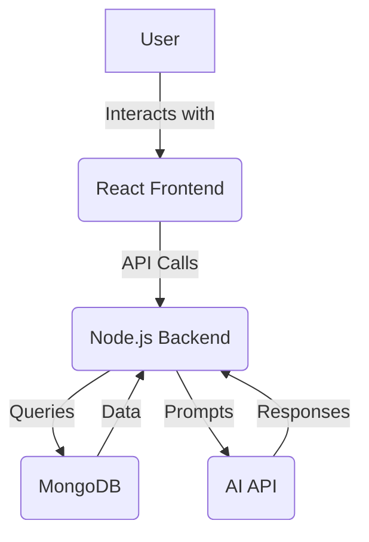
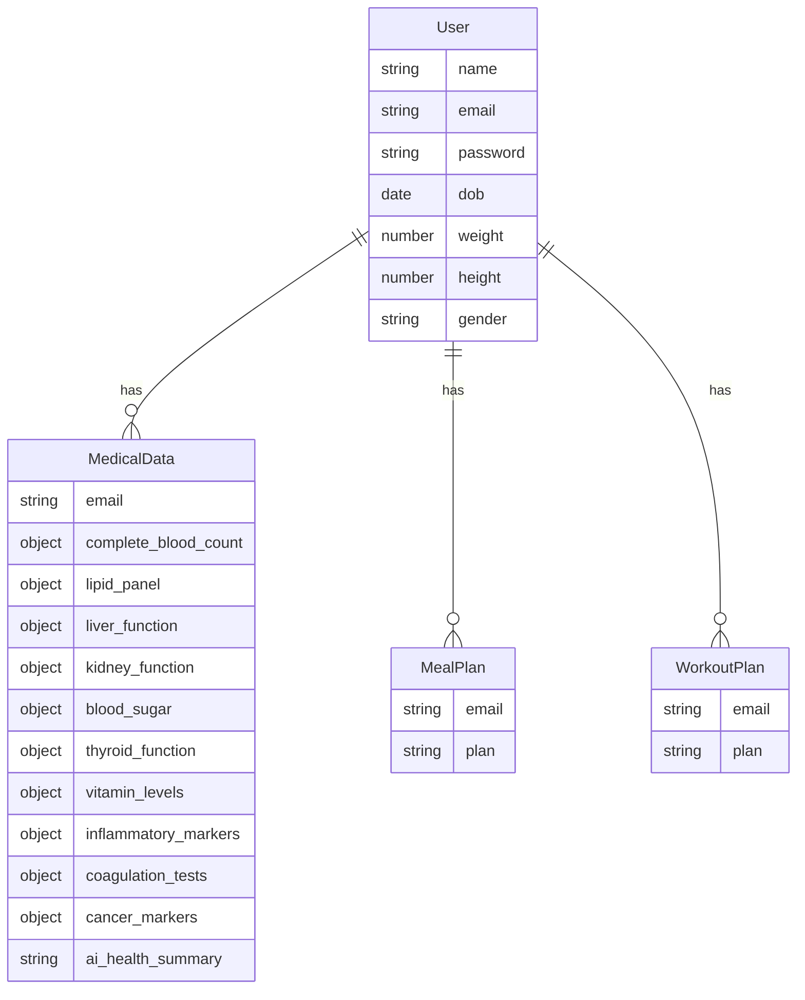

# NutriGuide AI

NutriGuide AI is an intelligent nutrition assistant designed to provide personalized dietary guidance. It leverages the power of a powerful AI model to deliver meal plans, workout routines, and health summaries tailored to your unique medical data and preferences.

**Live Demo:** [nutriguideai.vercel.app](https://nutriguideai.vercel.app/)

## Key Features

*   **AI-Powered Chatbot:** Get instant answers to your nutrition and fitness questions with our intelligent, streaming chatbot.
*   **Personalized Diet Plans:** Receive custom 7-day diet plans based on your medical data, location, and dietary preferences.
*   **Custom Workout Plans:** Get personalized 7-day workout plans that take into account your fitness level, goals, and medical history.
*   **AI Health Summary:** Get a comprehensive, AI-generated summary of your health based on your medical records.
*   **Secure Data Management:** All your data is securely stored in a unified MongoDB database.

## Architecture

### Frontend

The frontend is a modern, responsive single-page application built with React and Vite. For more details, see the [frontend README](./frontend/README.md).

### Backend

The backend is a robust Node.js application built with Express. It uses MongoDB for data storage and the Google Vertex AI SDK to interact with the AI model. For more details, see the [backend README](./backend/README.md).

### System Architecture Diagram

### Database Schema

## Deployment

The application can be configured for continuous deployment to Azure Web App using GitHub Actions. The workflow can be defined in `.github/workflows/main_nutriback.yml`.
